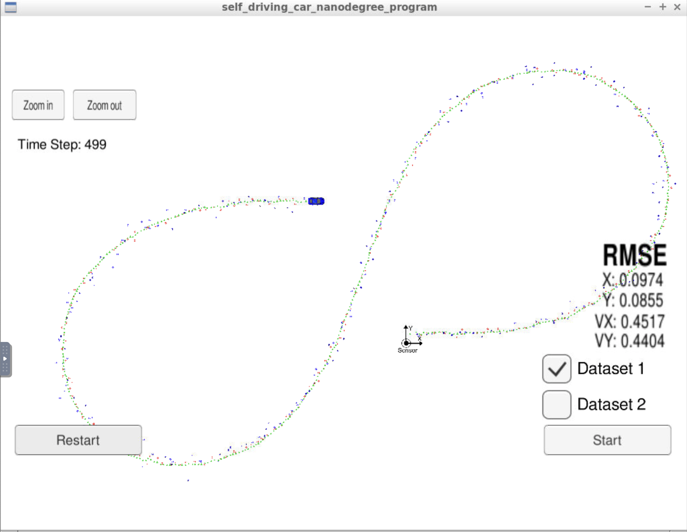
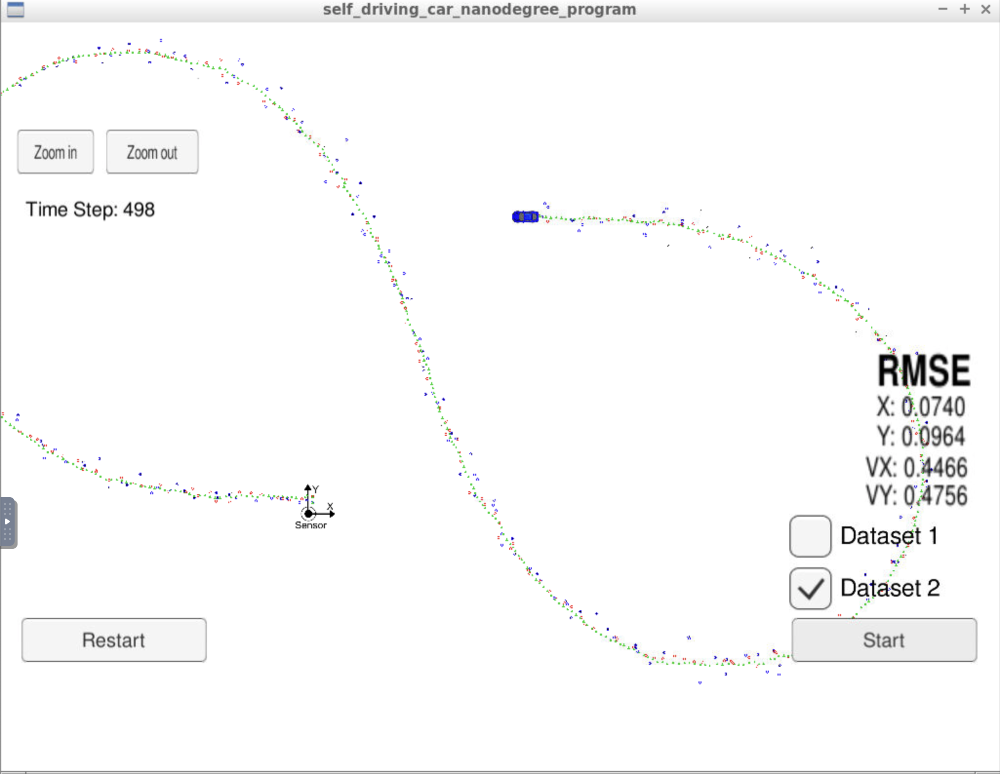

# Extended Kalman Filter

### Project Description

In this project you will utilize a kalman filter to estimate the state of a moving object of interest with noisy lidar and radar measurements. Summary of what needs to be done:

* In `tools.cpp`, fill in the functions that calculate root mean squared error (RMSE) and the Jacobian matrix.
* Fill in the code in `FusionEKF.cpp`. You'll need to initialize the Kalman Filter, prepare the Q and F matrices for the prediction step, and call the radar and lidar update functions.
* In `kalman_filter.cpp`, fill out the `Predict()`, `Update()`, and `UpdateEKF()` functions.

### Project Rubric

- Code must compile without errors with `make` and `cmake`.
- RMSE from Dataset1 must be less than `[0.11, 0.11, 0.52, 0.52]`.
- Code must follow correct algorithm.

----

### 1. Code Walk-through

Below are the list of files and their functions:

- `main.cpp` - communicates with the Term 2 Simulator receiving data measurements, calls a function to run the Kalman filter, calls a function to calculate RMSE
- `FusionEKF.cpp` - initializes the filter, calls the predict function, calls the update function
- `kalman_filter.cpp`- defines the predict function, the update function for lidar, and the update function for radar
- `tools.cpp`- function to calculate RMSE and the Jacobian matrix

Here is a brief overview of what happens when you run the code files:

1. `Main.cpp` reads in the data and sends a sensor measurement to `FusionEKF.cpp`
2. `FusionEKF.cpp` takes the sensor data and initializes variables and updates variables. The Kalman filter equations are not in this file. `FusionEKF.cpp` has a variable called `ekf_`, which is an instance of a `KalmanFilter` class. The `ekf_` will hold the matrix and vector values. You will also use the `ekf_` instance to call the predict and update equations.
3. The `KalmanFilter` class is defined in `kalman_filter.cpp` and `kalman_filter.h`. 

### 2. Watch-outs and Best-practices

- **Initialize the vectors and matrices used:** note that the `MatrixXd` and `VectorXd` in `Eigen` library does not initialize themselves, so it is important to assign meaningful initial values to the vectors and matrices.
- **Working with angles:**
  - Use the `atan2` function in C++, `atan2(y, x)` returns the principal value of the arctan of (y/x), expressed in radians (between -3.14 and 3.14).
  - Double check the angle value: although `atan2` outputs value between -pi and pi, watchout the observation error calculation `y = z - z_pred`, this could make the value go beyond (-pi, pi) range. It is good to always put a range limit check, if the angle falls beyond the range, add or subtract by 2*pi to bring them back.
- **Avoid division by zero:** at Jacobian matrix calculation, and Radar measurement polar velocity calculation, there are potential risks of division-by-zero, make sure to add range limit checks to prevent this.

### 3. Results and Discussion

Below is the results I got from dataset1, on the chart, red dots represent LIDAR measurement, blue dots represent RADAR measurement, and the green dots are projected (Kalman filter) location of the object.

It is easy and straightforward to understand from this image that: the measurements are noisy, but the Kalman Filter takes these noisy inputs and apply "smoothness filter" to give its best guess to the object location.

 

Below is the result from dataset2, both datasets are showing low RMSE.

